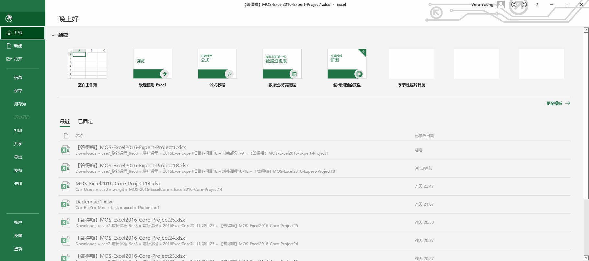
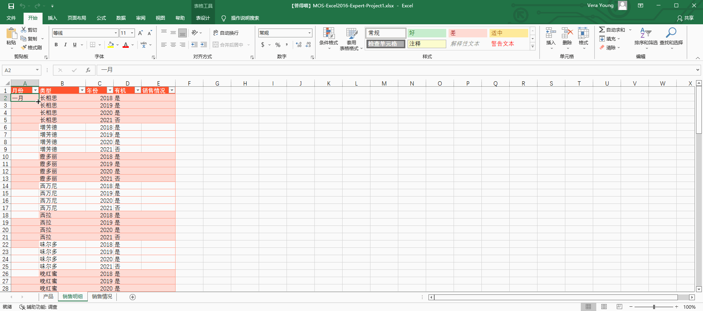
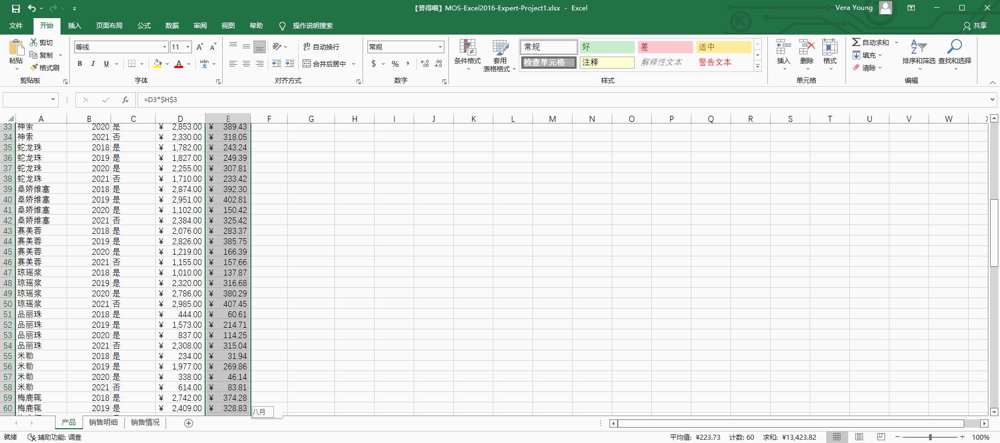
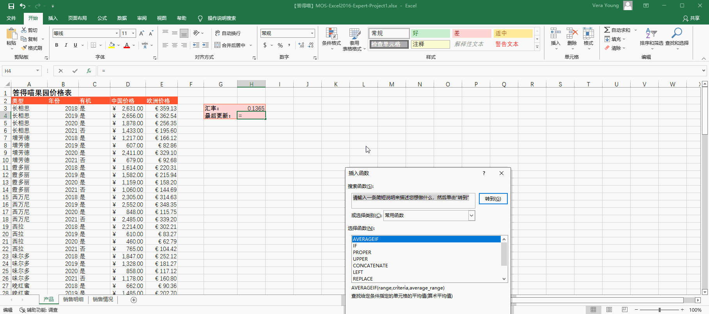
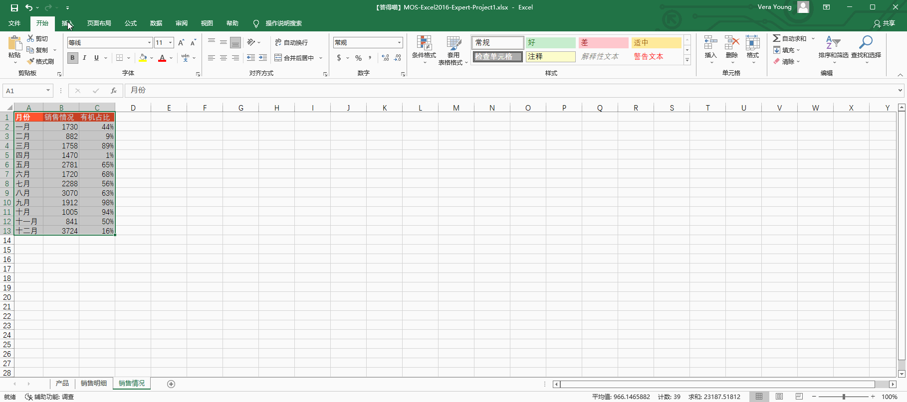

# Back to Main File
[Back](../README.md)

# Exercise File
[Expert-Project1](MOS-Excel2016-Expert-Project1.xlsx)

# Description
你在答得喵果园商业部工作。你正在制作一个Excel工作簿以分析产品销售情况。

# Task 1
修改工作簿计算选项，使得包含公式的单元格不显示修改值后的结果，直到手动重算或保存工作簿。
# Task 1 Answer

  
Click to see answer

# Task 2
在“销售明细”工作表，用“一月”填充A3:A117单元格。不要更改单元格格式。

# Task 2 Answer

  
Click to see answer

# Task 3
在“产品”工作表，将E3:E118单元格的数据设置为欧元格式，但不指定特定的语言或国家。欧元标记应在金额之前。不要创建自定义格式。

# Task 3 Answer

  
Click to see answer

# Task 4
在“产品”工作表，在H4单元格增加一个公式以增加当前的日期和时间。

# Task 4 Answer

  
Click to see answer

# Task 5
在“销售情况”工作表，增加一个图表，将销售情况以面积图显示、有机占比以使用次坐标轴的折线图显示。

# Task 5 Answer

  
Click to see answer

