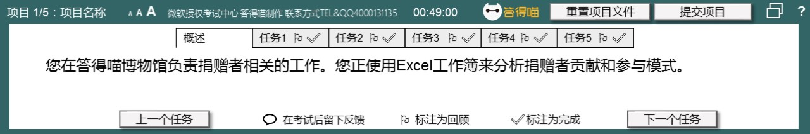
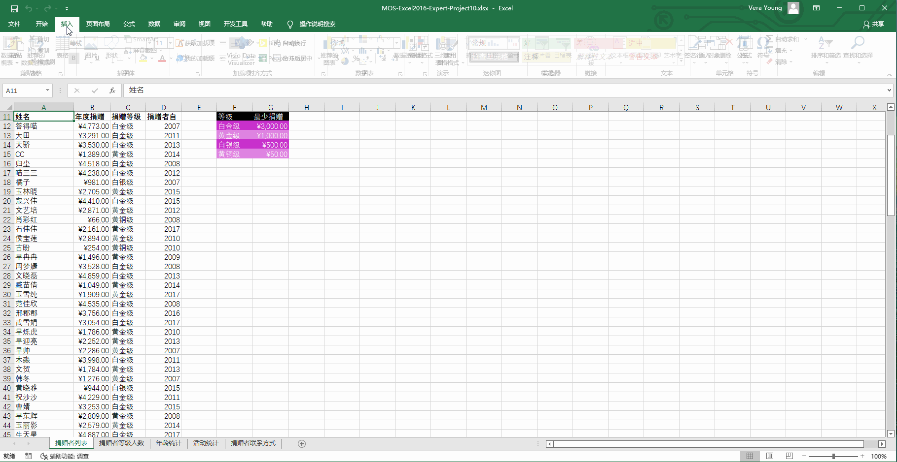
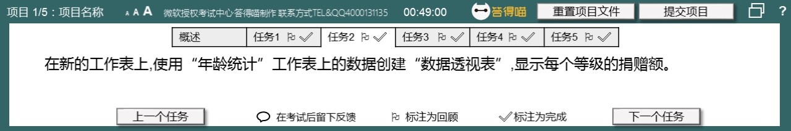
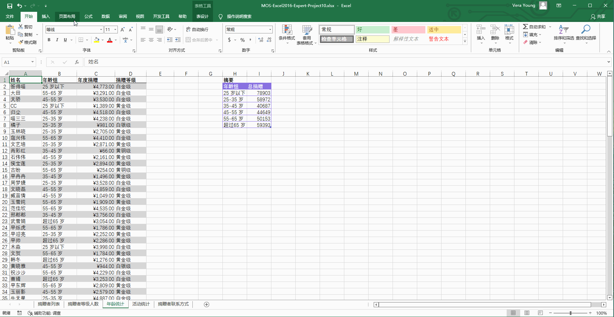
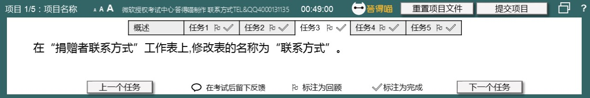
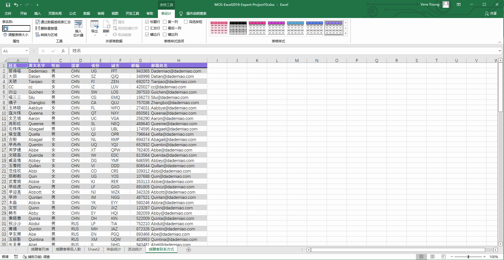
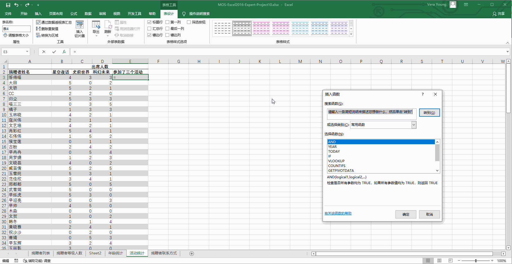
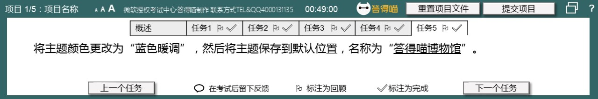
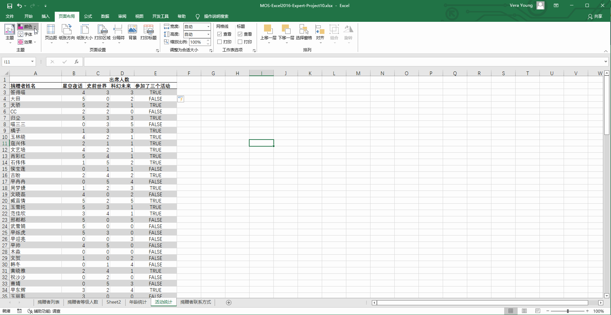

# Back to Main File
[Back](../README.md)

# Exercise File
[Expert-Project10](MOS-Excel2016-Expert-Project10.xlsx)

# Description
您在答得喵博物馆负责捐赠者相关的工作。您正使用Excel工作簿来分析捐赠者贡献和参与模式。

# Task 1
在“捐赠者等级人数”工作表上,使用“捐赠者列表”工作表上的数据创建“数据透视图”来显示年平均捐赠。在水平轴上,显示“捐赠者自”以及每个年份中各个“捐赠等级”的情况。

# Task 1 Answer

  
Click to see answer

# Task 2
在新的工作表上,使用“年龄统计”工作表上的数据创建“数据透视表”,显示每个等级的捐赠额。

# Task 2 Answer

  
Click to see answer

# Task 3
在“捐赠者联系方式”工作表上,修改表的名称为“联系方式”。

# Task 3 Answer

  
Click to see answer

# Task 4
在“活动统计”工作表上，在列E中添加公式，使用AND函数在捐赠者参加了所有三个活动时显示TRUE,否则显示FALSE。

# Task 4 Answer

  
Click to see answer

`AND(B3>0,C3>0,D3>0)`

# Task 5
将主题颜色更改为“蓝色暖调”，然后将主题保存到指定输出位置，名称为“答得喵博物馆”。（指定输出位置点击【查询文件夹】查看）

# Task 5 Answer

  
Click to see answer

