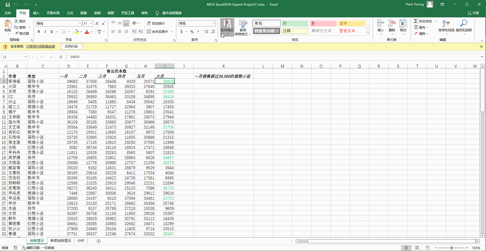
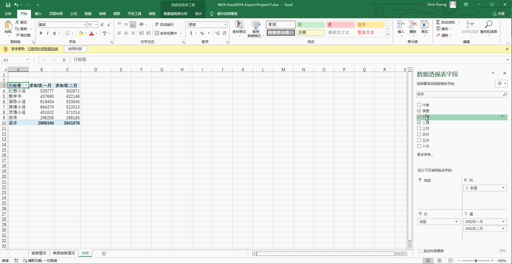
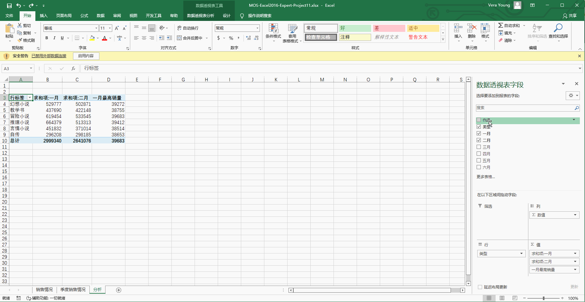
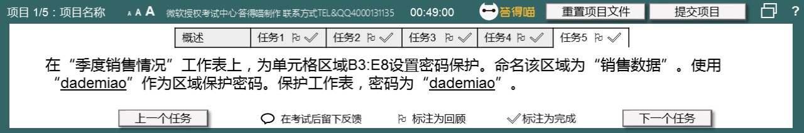
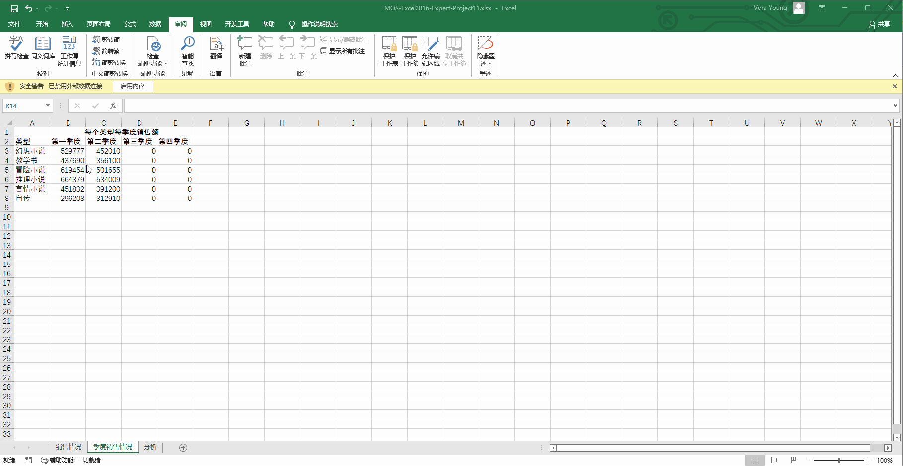

# Back to Main File
[Back](../README.md)

# Exercise File
[Expert-Project11](MOS-Excel2016-Expert-Project11.xlsx)

# Description
您正为答得喵印刷厂的采购经理准备销售报表。

# Task 1
在“销售情况”工作表上,修改单元格区域I3:I124的“条件格式”规则，使用内置规则将该列中所有高于平均值的数值的字体颜色更改为绿色。

# Task 1 Answer

  
Click to see answer

# Task 2
在“销售情况”工作表上的单元格K3中，使用公式计算一月售出超过30000本的“冒险小说”小说有多少种。

# Task 2 Answer

  
Click to see answer

# Task 3
在“分析”工作表的列D中添加一列内容，显示每种类型的一月最高销量。

# Task 3 Answer

  
Click to see answer

# Task 4
在“分析”工作表上，添加“作者”行到每种“类型”下方。

# Task 4 Answer

  
Click to see answer

# Task 5
在“季度销售情况”工作表上，为单元格区域B3:E8设置密码保护。命名该区域为“销售数据”。使用“dademiao”作为区域保护密码。保护工作表，密码为“dademiao”。

# Task 5 Answer

  
Click to see answer

