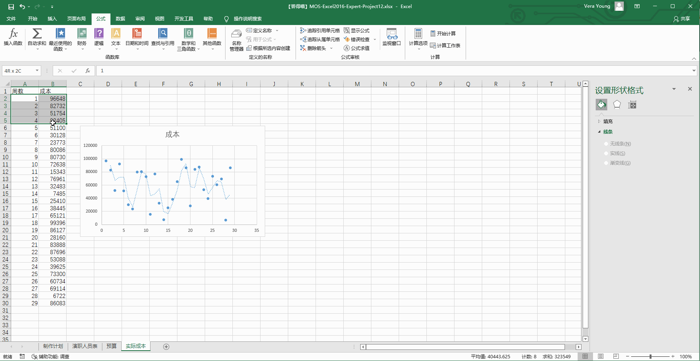

# Back to Main File
[Back](../README.md)

# Exercise File
[Expert-Project12](MOS-Excel2016-Expert-Project12.xlsx)

# Description
您正在准备用于在答得喵情景剧项目视频制作期间，跟踪项目规划各个方面的工作簿。

# Task 1
在“功能区”显示“开发工具”选项卡。

# Task 1 Answer

  
Click to see answer

# Task 2
在“制作计划”工作表上的单元格B3中,使用单个函数显示在“演职人员表”工作表上分配了“导演” 角色的人名。

# Task 2 Answer

  
Click to see answer

# Task 3
在“预算”工作表上，追踪在公式中直接或间接引用了单元格B3值的所有单元格。

# Task 3 Answer

  
Click to see answer

# Task 4
在“实际成本” 工作表上，添加“移动平均”趋势线到图表。

# Task 4 Answer

  
Click to see answer

# Task 5
在“实际成本”工作表上，将单元格区域A2:B5命名为“月1”,范围在工作簿内。

# Task 5 Answer

  
Click to see answer

