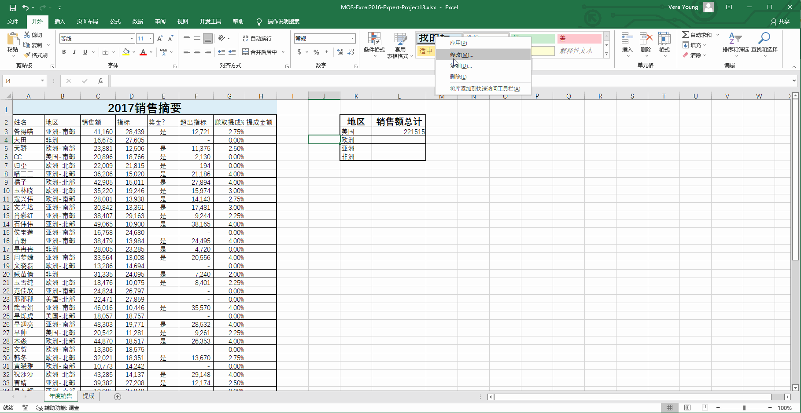
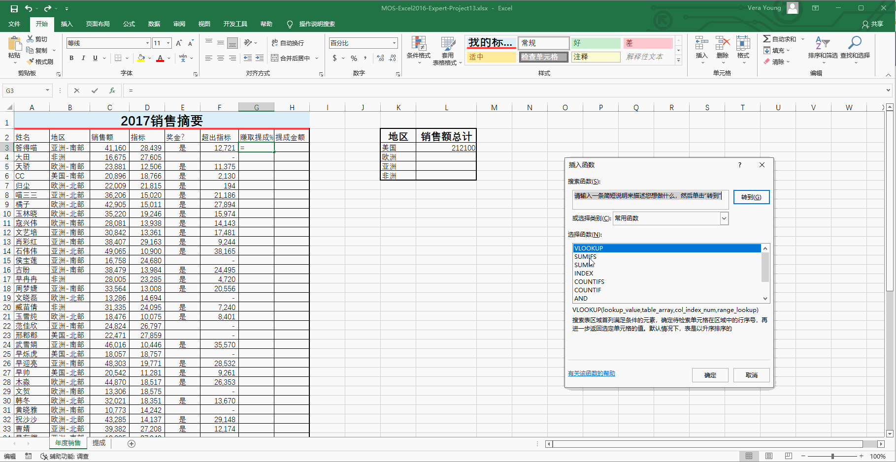
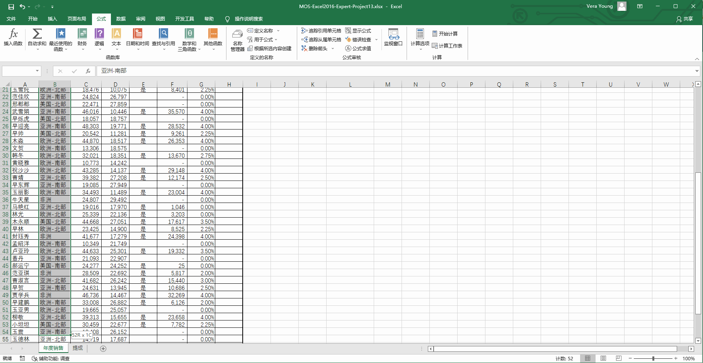
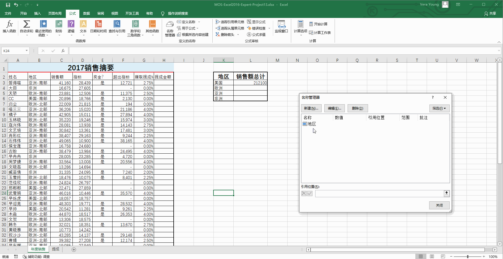

# Back to Main File
[Back](../README.md)

# Exercise File
[Expert-Project13](MOS-Excel2016-Expert-Project13.xlsx)

# Description
您在答得喵考试中心的推广部门工作。您正在制作与经理开会使用的年末销售摘要文件。

# Task 1
通过添加红色底端双边框来修改“我的标题”样式。

# Task 1 Answer

  
Click to see answer

# Task 2
在“年度销售”工作表的单元格L3中，使用条件求和函数计算获得奖金的美国员工的总销售额。

# Task 2 Answer

  
Click to see answer

# Task 3
在“年度销售”工作表上的列G中，使用Vlookup函数从“提成”表检索每位员工挣取的提成百分比。不要更改引用列中的任何值。

# Task 3 Answer

  
Click to see answer

# Task 4
在“年度销售”工作表上，将单元格区域B3:B60命名为“地区”。名称创建在工作簿范围内。

# Task 4 Answer

  
Click to see answer

# Task 5
修改工作簿中的名称“销售摘要”，使其仅包含单元格区域K3:L6。

# Task 5 Answer

  
Click to see answer

