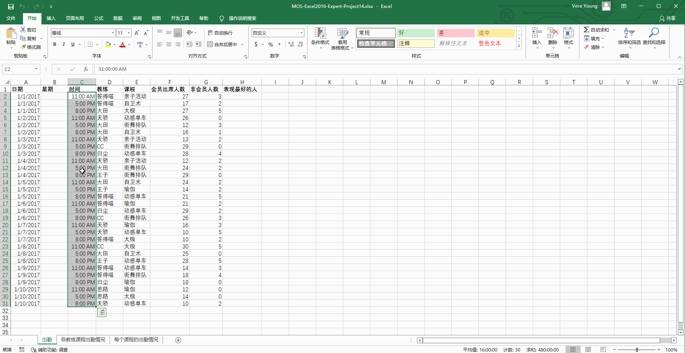
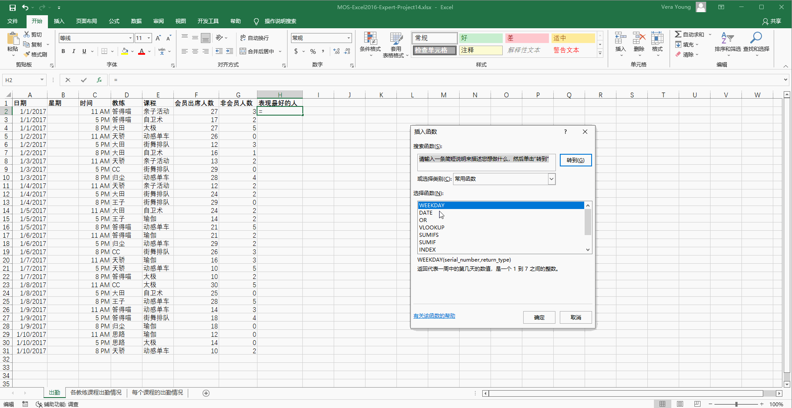
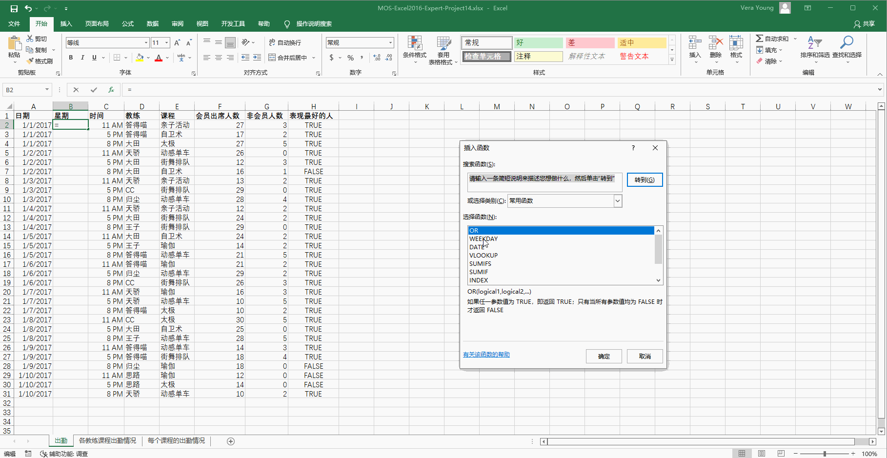
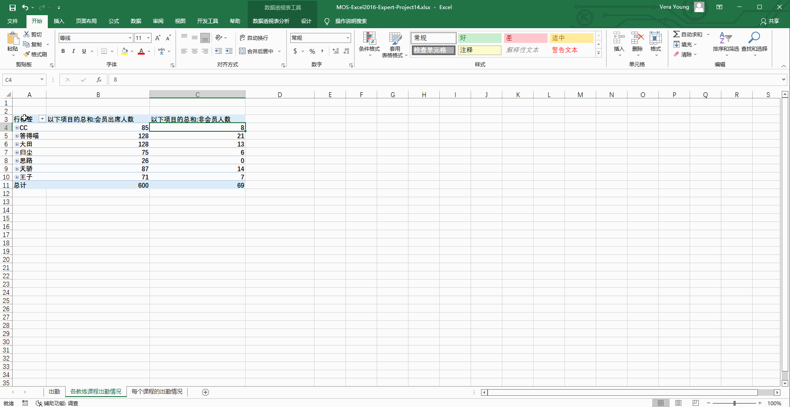
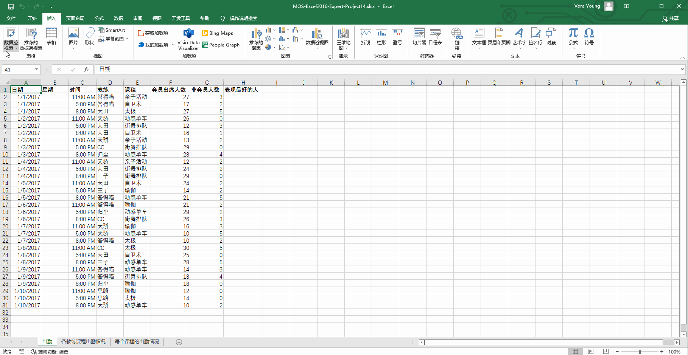

# Back to Main File
[Back](../README.md)

# Exercise File
[Expert-Project14](MOS-Excel2016-Expert-Project14.xlsx)

# Description
答得喵健身房正在着手提供健身课程以吸引新的客户。您正在使用Excel分析课程出勤数据。

# Task 1
在“出勤”工作表上，设置列C的格式，使该列种所有的时间值都显示为“h AM/PM”，不要显示分钟。

# Task 1 Answer

  
Click to see answer

# Task 2
在“出勤”工作表列H中，插入or函数，如果会员出席人数超过任意课程的平均会员出席人数，或非会员人数超过1人，显示为TRUE。否则，显示为FLASE。

# Task 2 Answer

  
Click to see answer

# Task 3
在“出勤”工作表的列B中添加公式，根据同一行列A种的日期对应的星期数值来显示1至7的数字。星期日以数值1表示，星期六以数值7表示。

# Task 3 Answer

  
Click to see answer

# Task 4
在“各教练课程出勤情况”工作表中添加切片器，以便用户能够仅显示特定时间提供的课程数据。时间值应精确到小时、分钟和秒。

# Task 4 Answer

  
Click to see answer

# Task 5
在新的工作表上创建“带数据标记的折线图”“数据透视图”，显示每个课程的最大会员出席人数和最大非会员出席人数。

# Task 5 Answer

  
Click to see answer

