# Back to Main File
[Back](../README.md)

# Exercise File
[Expert-Project15](MOS-Excel2016-Expert-Project15.xlsx)

# Description
答得喵艺术评委会基于比赛的评审结果和企业赞助发放奖学金。您正在制作确定奖学金金额的电子表格。

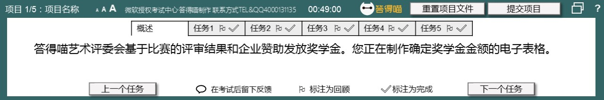

# Task 1
在“赞助情况” 工作表的单元格K1中，添加公式，使用“汇总”行中的结构化引用，计算所有公司为每位艺术家提供的平均赞助。
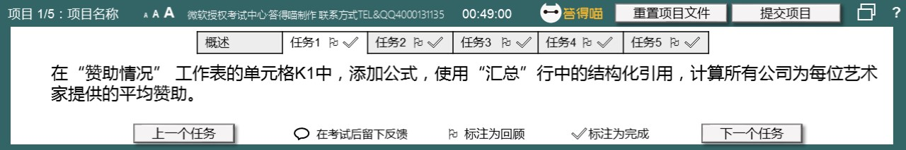

# Task 1 Answer

  
Click to see answer

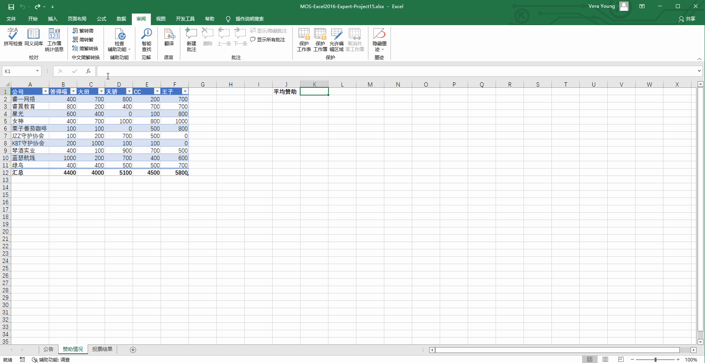

# Task 2
修改Excel选项，防止在更改数据时自动重新计算公式数值。在保存工作簿时要重新计算“公式”数值。

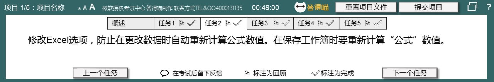

# Task 2 Answer

  
Click to see answer

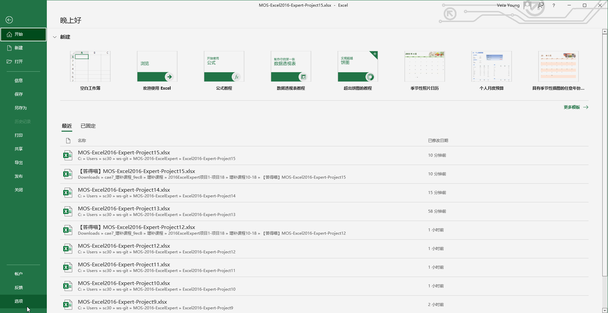

# Task 3
在“赞助情况” 工作表的单元格A2:A11中添加条件格式规则，对承诺赞助超过￥3000的所有公司名称应用RGB“146”、“208”、“80” 的填充颜色。

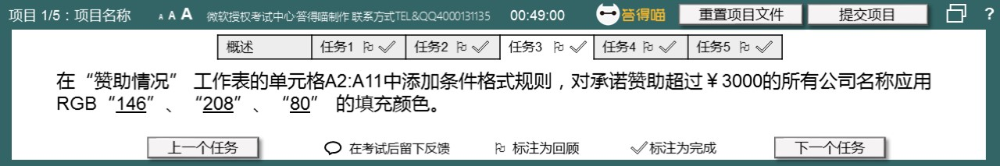

# Task 3 Answer

  
Click to see answer

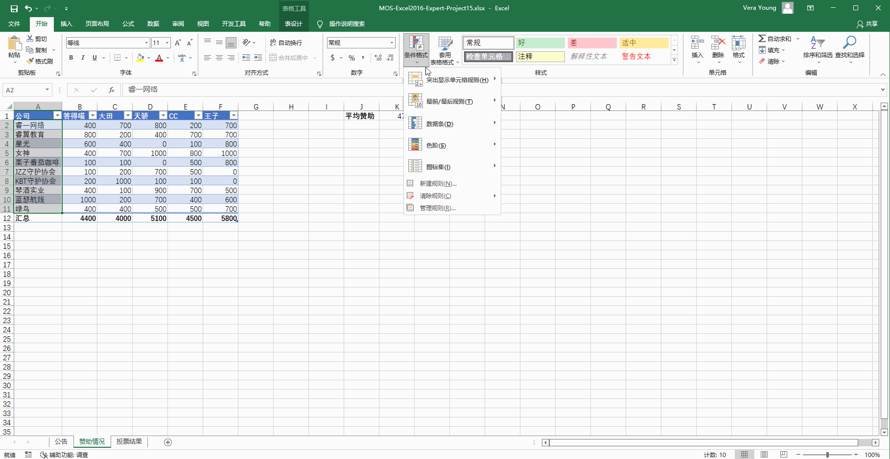

# Task 4
在“公告” 工作表上，使用“奖项图表” 的名称将图表作为模版保存到指定输出位置。（指定输出位置点击【查询文件夹】查看）

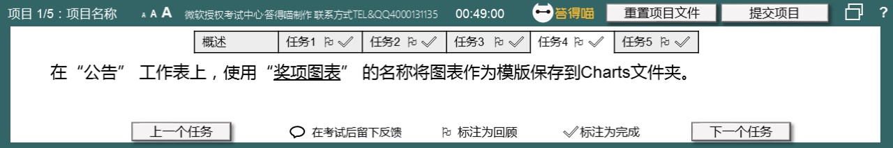

# Task 4 Answer

  
Click to see answer

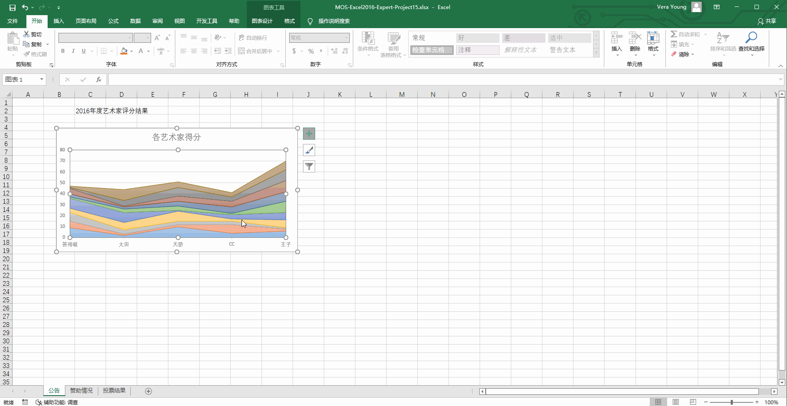

# Task 5
除非输入密码“dademiao” ，阻止其他用户修改“投票结果” 工作表中的数据。用户可以选择和格式化单元格、列以及行，而不必输入密码。

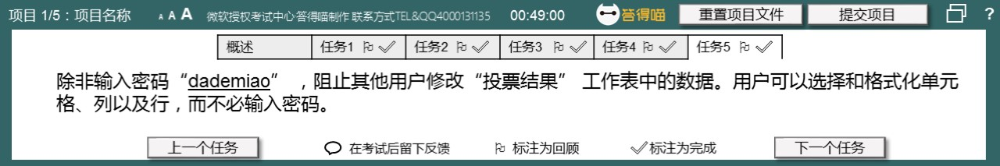

# Task 5 Answer

  
Click to see answer

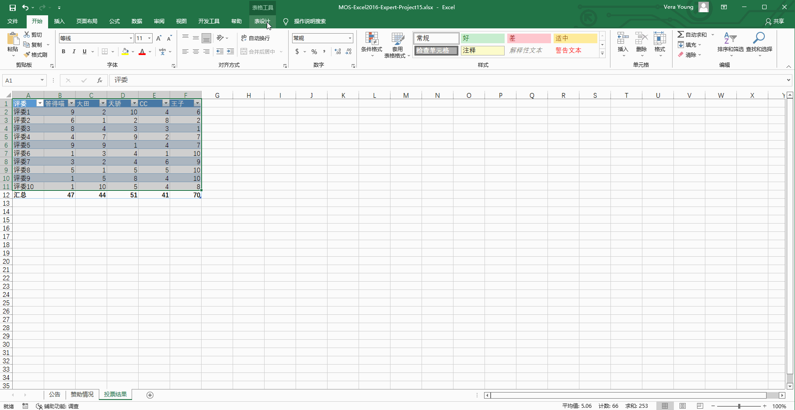

