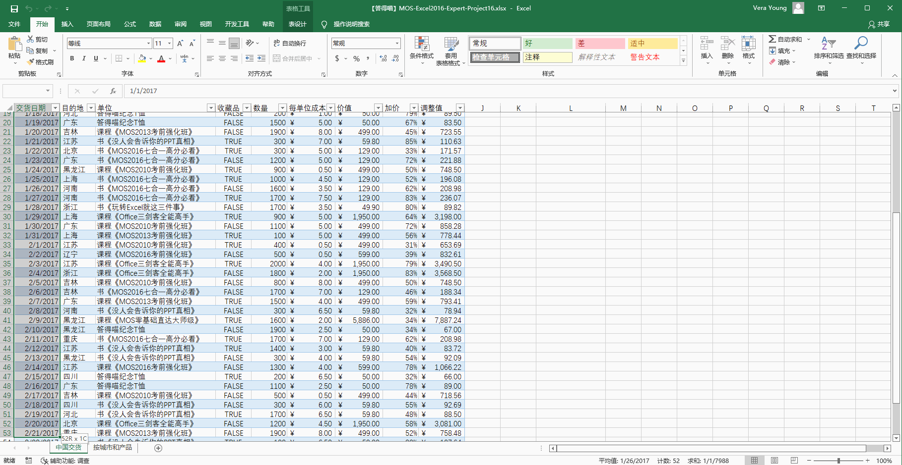
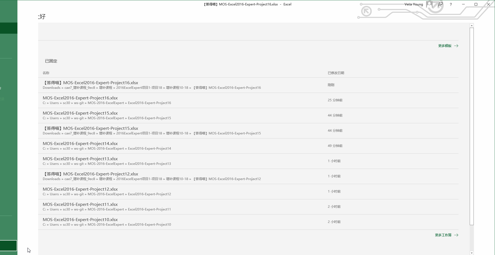
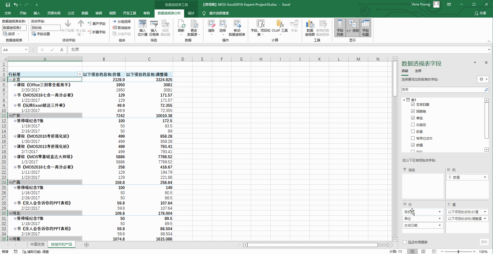
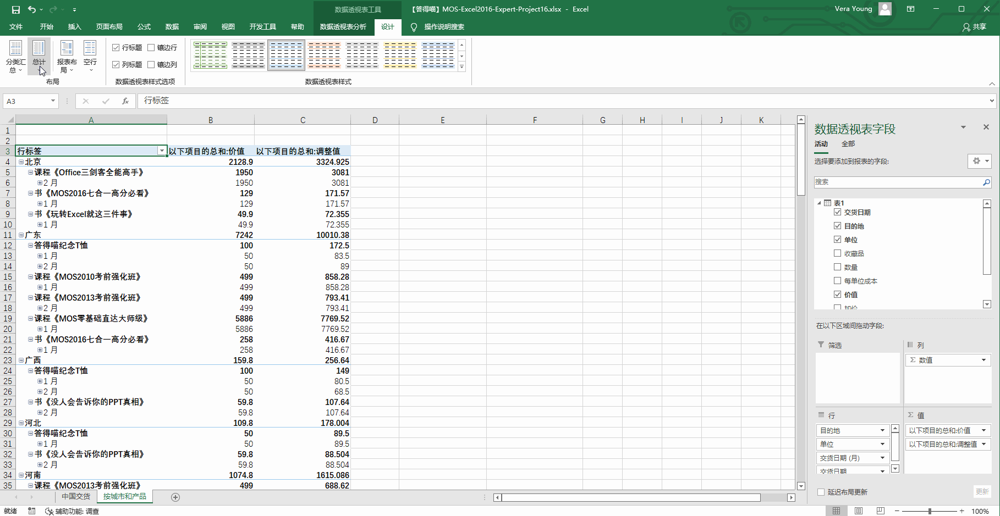

# Back to Main File
[Back](../README.md)

# Exercise File
[Expert-Project16](MOS-Excel2016-Expert-Project16.xlsx)

# Description
答得喵物流派送商品到中国的各个零售店。您正在使用Excel跟踪和分析发货信息。

# Task 1
在“中国交货”工作表上，使用格式“14 de marzo de 2012” 将列A格式化为“西班牙语(墨西哥)”日期。

# Task 1 Answer

  
Click to see answer

# Task 2
在错误检查规则中，启用标记列内不一致公式的选项。

# Task 2 Answer

  
Click to see answer

# Task 3
在“中国交货”工作表上创建图表，在横轴上显示“单位”。每次发货的“价值”显示为“簇状柱形图”，每次发货的“加价”显示为“折线图”。

# Task 3 Answer

  
Click to see answer

# Task 4
在“按城市和产品”工作表上，首先按城市分组数据，然后按产品类型分组数据，最后按交货日期的月份分组数据。

# Task 4 Answer

  
Click to see answer

# Task 5
在“按城市和产品”工作表上，以表格形式显示数据，并在每个项目后插入一个空白行。

# Task 5 Answer

  
Click to see answer

