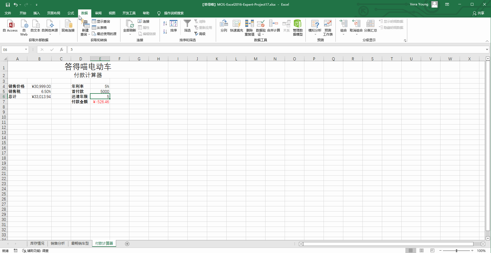

# Back to Main File
[Back](../README.md)

# Exercise File
[Expert-Project17](MOS-Excel2016-Expert-Project17.xlsx)

# Description
您正在创建公销售经理使用的Excel工作簿。

# Task 1
在“付款计算器” 工作表的单元格E7中，添加公式来计算每月付款金额，假定付款日期为月初。从本金中减去“首付款”金额。

# Task 1 Answer

  
Click to see answer

# Task 2
在“库存情况”工作表上，在列H中添加公式，如果库存汽车数量超过了“上月销售”的两倍，或超过“年度销售”的月平均值时显示“是”，否则，显示“否”。

# Task 2 Answer

  
Click to see answer

# Task 3
在“库存情况”工作表上，对数据所在行应用格式，如果“上月销售”超过“库存数量” 的90%，则粗体显示文本，同时将文本颜色更改为RGB“0”，“176”，“80” 。

# Task 3 Answer

  
Click to see answer

# Task 4
在“付款计算器”工作表上，为单元格E6添加数据验证，以便在用户输入小于1或者大于5的值，或输入包含小数位的数字时显示“停止”的出错警告，标题为“无效”，错误信息为“1到5”。

# Task 4 Answer

  
Click to see answer

# Task 5
在“销售分析”工作表上，修改图表以便按照每一个年份分组显示车型。

# Task 5 Answer

  
Click to see answer

