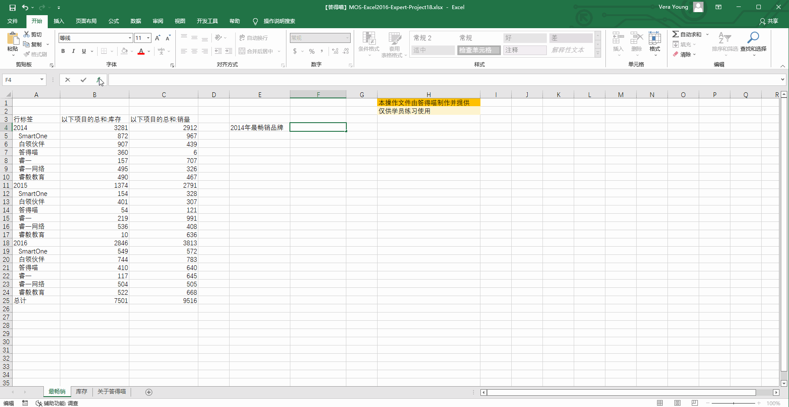

# Back to Main File
[Back](../README.md)

# Exercise File
[Expert-Project18](MOS-Excel2016-Expert-Project18.xlsx)

# Description
答得喵最畅销

# Task 1
在“最畅销”工作表的单元格F4中，添加使用多维数据集函数和数据模型的公式，检索2014年最畅销品牌的名称。

# Task 1 Answer

  
Click to see answer

