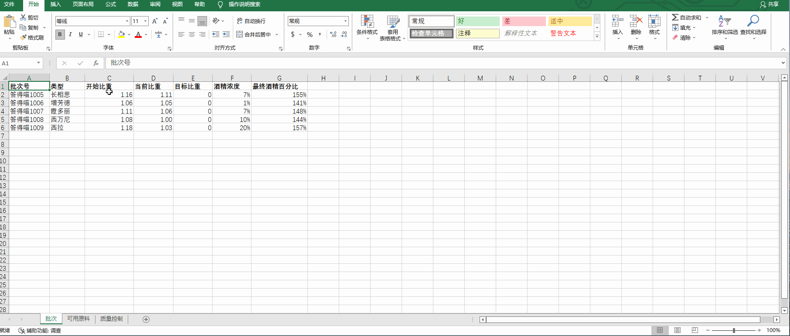
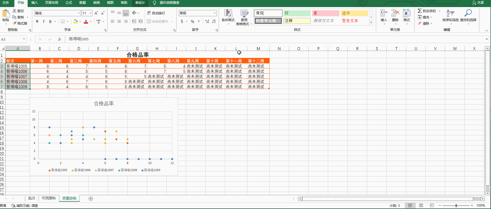
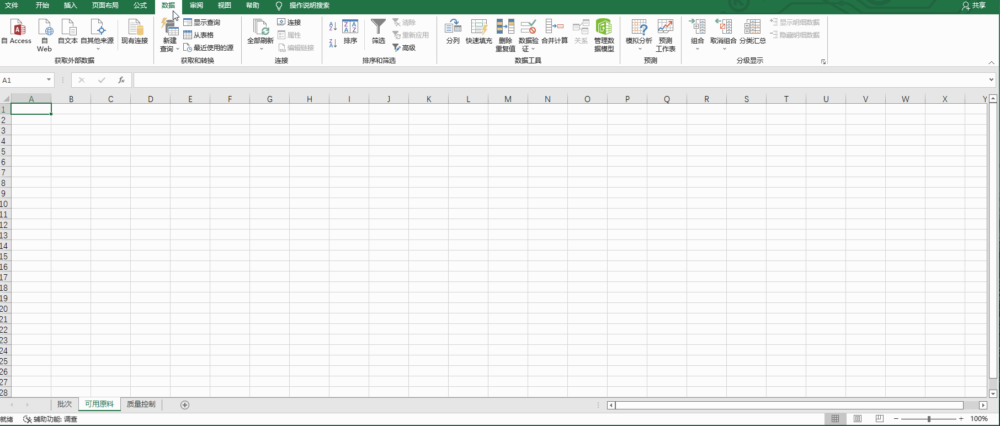
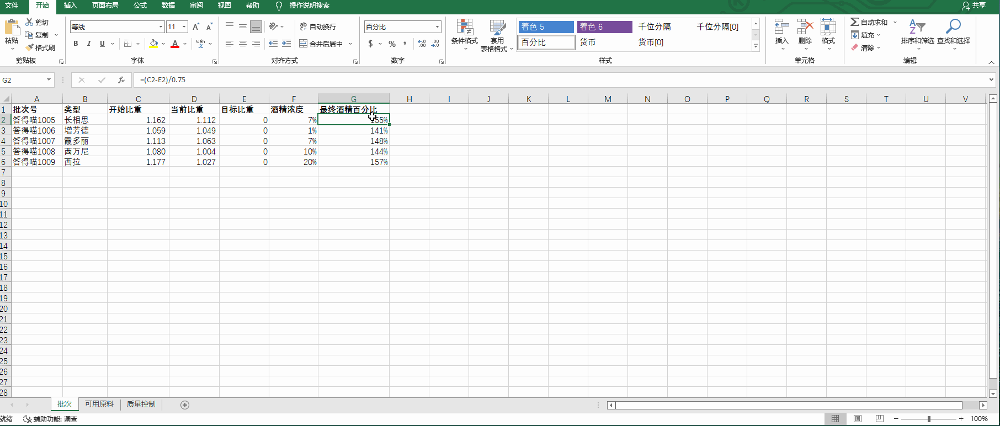
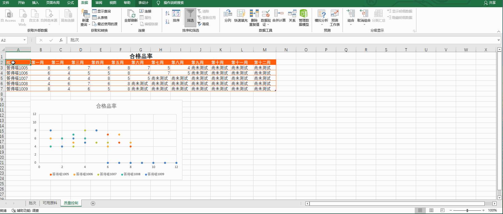

# Back to Main File
[Back](../README.md)

# Exercise File
[Expert-Project2](MOS-Excel2016-Expert-Project2.xlsx)

# Description
你为答得喵果园和酒庄工作。你正在创建一个Excel工作簿用于帮助酿酒师调整酿酒步骤的各个方面。

# Task 1
在“批次”工作表，为C列和D列设置格式，使其数值显示为三位小数。格式应应用到已存在的行和新的行。
# Task 1 Answer

  
Click to see answer

# Task 2
在“质量控制”工作表，对A3:A7单元格设置格式，使其在已测试的所有周的平均合格品率低于5时，填充50%灰色图案样式、红色图案颜色。

# Task 2 Answer

  
Click to see answer

# Task 3
在“可用原料”工作表，使用查询来加载素材文件夹的收获日志.xlsx工作簿到以A1单元格开始的单元格。
仅包括“种类”、“地址”和“原始公升数”列。（素材文件夹点击【查询文件夹】查看）

# Task 3 Answer

  
Click to see answer

# Task 4
在“批次”工作表，使用Excel预测功能，计算批次号答得喵1005的“目标比重”，以使得“最终酒精百分比”是15%。

# Task 4 Answer

  
Click to see answer

# Task 5
在“质量控制”工作表，将表格名称从“表2”更改为“周合格品率”。

# Task 5 Answer

  
Click to see answer

# Task 5
在“质量控制”工作表，在图表中增加一个线性趋势线，使其预测批次答得喵1005到第十二周的合格品率。

# Task 5 Answer

  
Click to see answer

