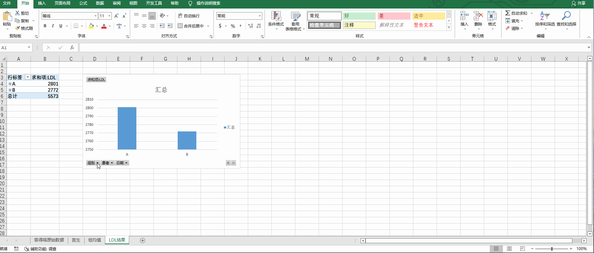
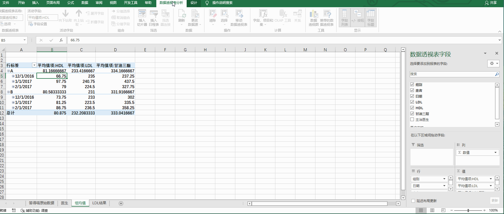

# Back to Main File
[Back](../README.md)

# Exercise File
[Expert-Project3](MOS-Excel2016-Expert-Project3.xlsx)

# Description
答得喵药品研发公司正在进行一个新药研发。你使用一个Excel工作簿记录和分析实验数据。

# Task 1
在“LDL结果”工作表，修改图表，使其仅显示B组每个成员的逐月数据。
# Task 1 Answer

  
Click to see answer

# Task 2
在“组均值”工作表，增加一个切片器，允许用户交互式地限制数据透视图展示的行，将其限制为特定HDL值。

# Task 2 Answer

  
Click to see answer

# Task 3
在“组均值”工作表，从数据透视表中移除总计行。

# Task 3 Answer

  
Click to see answer

# Task 4
在“答得喵原始数据”工作表，将一个组合框控件链接到G2单元格。它应显示“医生”工作表上A列的三个名字。

# Task 4 Answer

  
Click to see answer

# Task 5
在“答得喵原始数据”工作表，对E列应用条件格式。当值大于等于70显示绿色圆圈、值小于70大于等于40显示黄色圆圈、值小于40显示红色圆圈。格式应应用到已存在的行和新的行。

# Task 5 Answer

  
Click to see answer

