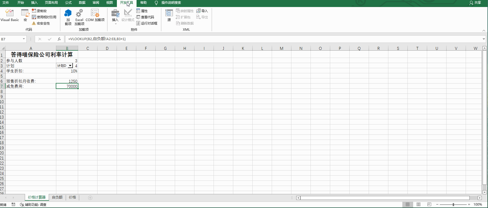
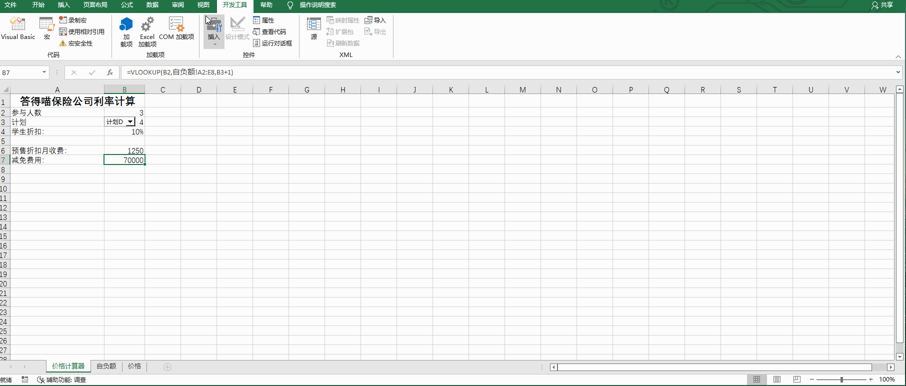
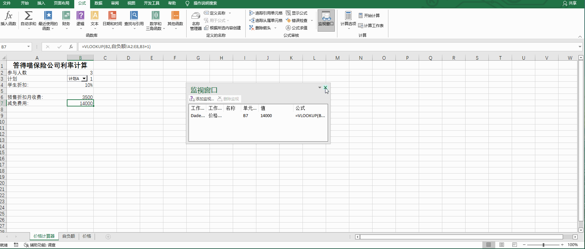

# Back to Main File
[Back](../README.md)

# Exercise File
[Expert-Project4](MOS-Excel2016-Expert-Project4.xlsx)

# Description
你在答得喵保险公司工作。你正在准备一个可以生成客户报价的工作簿。

# Task 1
预售折扣月收费使用公式“基础价格”+(参与者-1)*“每人额外收取”计算。
“基础价格”和“每人额外收取”的数值位于“价格”工作表。在“价格计算器”工作表的B6单元格，
增加一个使用INDEX函数的公式，检索“基础价格” 和“每人额外收取”并计算“预售折扣月收费”。

# Task 1 Answer

  
Click to see answer

`=INDEX(价格!B2:B5,B3)+(B2-1)*INDEX(价格!C2:C5,B3)`

# Task 2
保护工作簿，使用户不能增加、删除、修改工作表，除非他们输入密码“www.dademiao.com”。

# Task 2 Answer

  
Click to see answer

# Task 3
仅启用有数字签名的宏。

# Task 3 Answer

  
Click to see answer

# Task 4
在“价格计算器”工作表，对B7单元格增加监视。

# Task 4 Answer

  
Click to see answer

# Task 5
在“价格计算器”工作表，将B4单元格命名为“折扣数”。在工作簿范围创建名称。

# Task 5 Answer

  
Click to see answer

