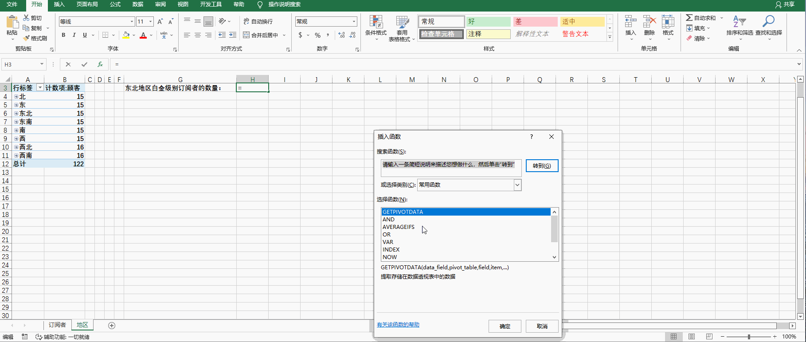

# Back to Main File
[Back](../README.md)

# Exercise File
[Expert-Project5](MOS-Excel2016-Expert-Project5.xlsx)

# Description
你在答得喵云数据服务公司工作。你正在创建一个数字表格帮助你分析数据并制定市场计划。

# Task 1
在“订阅者”工作表的F列，使用一个公式，使得如果用户超过了他们的用量限制显示TURE。否则，显示FALSE。你的公式中必须使用AND和OR函数。

# Task 1 Answer

  
Click to see answer

`=IF(AND(D2="白金",E2>$I$3),AND(D2="黄金",E2>$I$4),"是","否")`

`

# Task 2
在“订阅者”工作表的I6单元格，使用一个条件平均值函数，计算西南地区钻石等级订阅者的平均用量。

# Task 2 Answer

  
Click to see answer

# Task 3
在“订阅者”工作表的G列，使用一个公式，使得“钻石”等级或“白金”等级并且在“东北”地区的订阅者显示“促销1”，其他，显示“促销2”。

# Task 3 Answer

  
Click to see answer

# Task 4
数据透视表已经被增加到数据模型中。在“地区”工作表的H3单元格，使用GETPIVOTDATA来计算东北地区白金级别订阅者的数量。

# Task 4 Answer

## Information before doing this task: How Pivot table is generated

  
Click to see How pivot table is generated

  
Click to see answer

# Task 5
在“地区”工作表，创建簇状柱形数据透视图，以展示每个地区“钻石”级别和“白金”级别订阅者的数量。

# Task 5 Answer

  
Click to see answer

