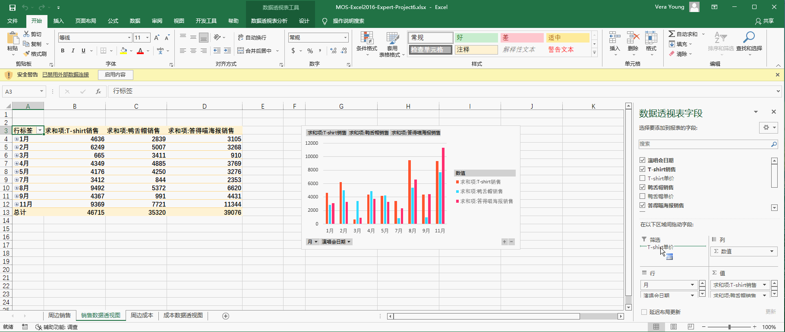
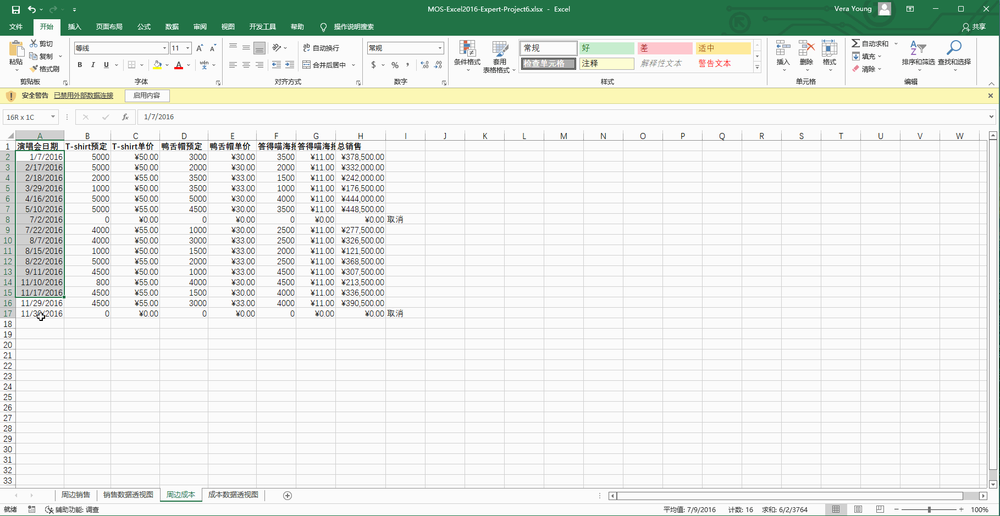
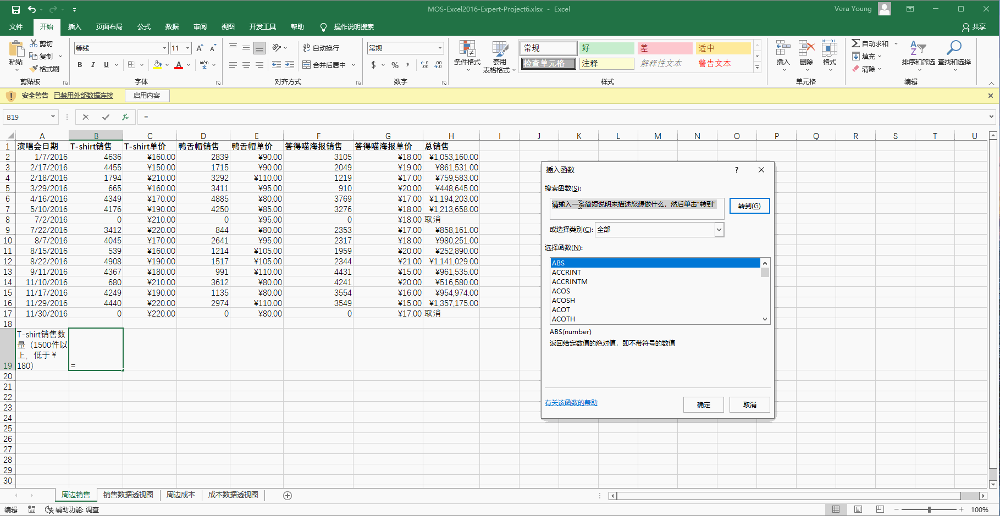
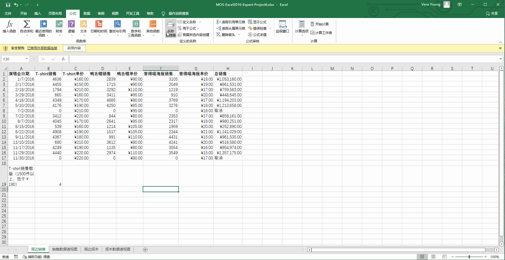
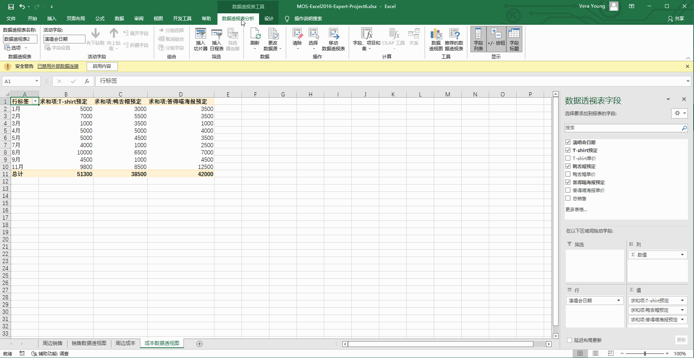

# Back to Main File
[Back](../README.md)

# Exercise File
[Expert-Project6](MOS-Excel2016-Expert-Project6.xlsx)

# Description
你是答得喵乐团的经纪人。你正在回顾去年所有演唱会周边的销售情况。

# Task 1
在“销售数据透视图”工作表，对数据透视图增加“T-shirt单价”字段作为筛选项。

# Task 1 Answer

  
Click to see answer

# Task 2
在“周边成本”工作表，更改A列的数据为西班牙语(墨西哥)并使用14 de marzo de 2012类型。更改C、E、G和H列货币为$西班牙语(墨西哥)。

# Task 2 Answer

  
Click to see answer

# Task 3
在“周边销售”工作表的B19单元格，计算在所有销售超过1500件T恤的演唱会中，以低于￥180售出的T恤数量。

# Task 3 Answer

  
Click to see answer

# Task 4
移除引用位置为“周边销售!$A$1:$H$17”的名称“销售”。

# Task 4 Answer

  
Click to see answer

# Task 5
在“成本数据透视图”工作表，增加一个3D堆积柱形图以展示数据透视表中的数据。

# Task 5 Answer

  
Click to see answer

