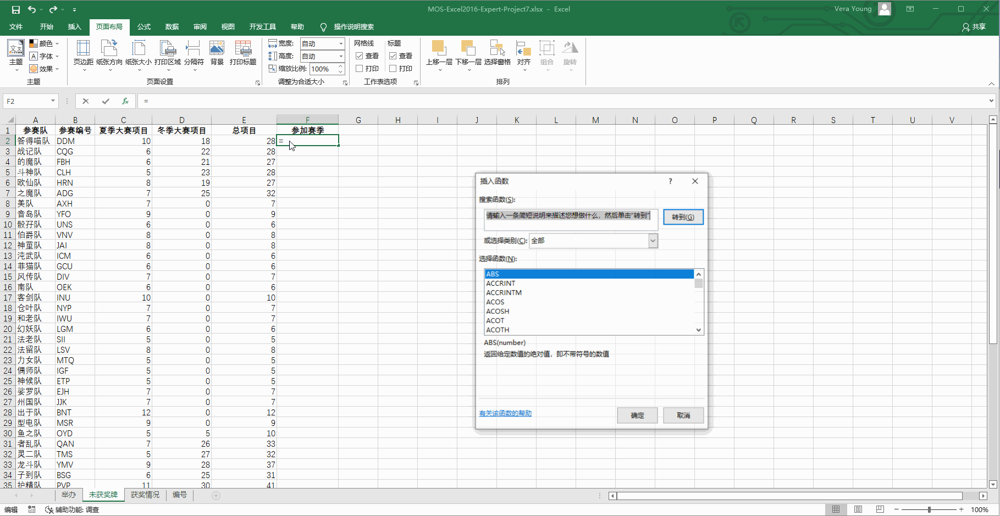

# Back to Main File
[Back](../README.md)

# Exercise File
[Expert-Project7](MOS-Excel2016-Expert-Project7.xlsx)

# Description
你是报社的记者。你被分配了介绍睿一网络Office大赛历史的任务。

# Task 1
在“未获奖牌”工作表的B2单元格，增加一个仅使用一个函数的公式，为“未获奖牌”工作表的A2单元格列出的参赛队查找其在“编号”工作表中的“参赛编号”。

# Task 1 Answer

  
Click to see answer

# Task 2
使用密码“www.dademiao.com”保护工作簿。

# Task 2 Answer

  
Click to see answer

# Task 3
以个性色1选项RGB“255”,“153”,“51”创建自定义颜色。将自定义颜色命名为“答得喵橙色”。

# Task 3 Answer

  
Click to see answer

# Task 4
在“未获奖牌”工作表的F2单元格创建一个公式以显示一个队伍参加了两个赛季或仅参加了夏季大赛。如果队伍参加了两个赛季，显示“都”。如果队伍仅参加了夏季大赛，显示“仅夏季”。

# Task 4 Answer

  
Click to see answer

# Task 5
在“举办”工作表的E列，创建一个公式，使用函数来显示距离每个城市举办比赛已经过去了多少年。

# Task 5 Answer

  
Click to see answer

