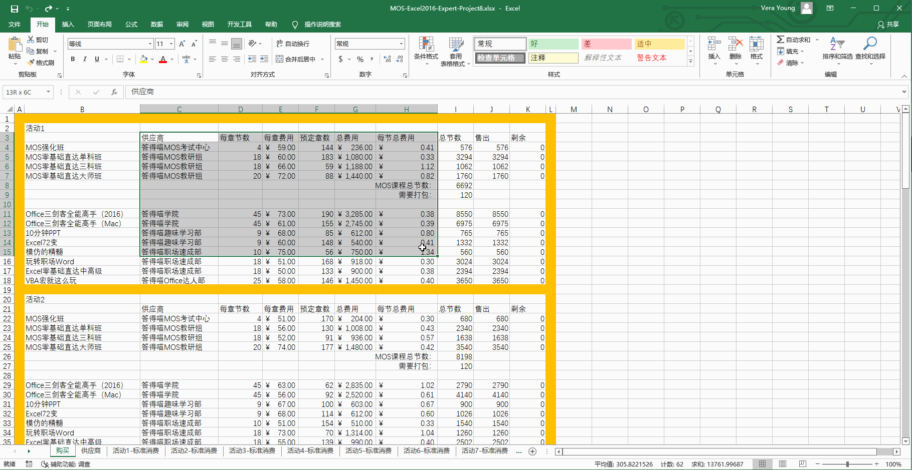
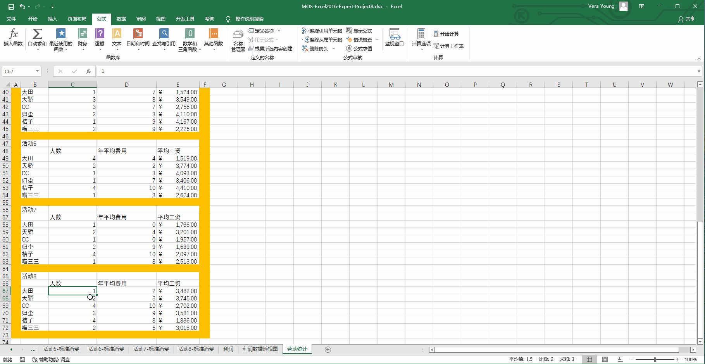

# Back to Main File
[Back](../README.md)

# Exercise File
[Expert-Project8](MOS-Excel2016-Expert-Project8.xlsx)

# Description
你是答得喵集团的会计。你创建了一个工作簿来跟踪记录答得喵各部门的活动进行情况。

# Task 1
修改工作簿计算选项，阻止数据改变时自动计算公式的值。保存工作簿时公式不应被计算。

# Task 1 Answer

  
Click to see answer

# Task 2
在“供应商”工作表的A2单元格创建一个数据透视表，以展示每个供应商总费用的平均值，其数据基于“购买”工作表的C3:K18单元格。在行上展示每个供应商。

# Task 2 Answer

  
Click to see answer

# Task 3
在“利润数据透视图”工作表，修改数据透视表的设置，使得无论何时打开文件均刷新数据。

# Task 3 Answer

  
Click to see answer

# Task 4
将“劳动统计”工作表的C67:E72单元格增加到监视窗口。

# Task 4 Answer

  
Click to see answer

# Task 5
在“活动1-标准消费”工作表的H9单元格，增加一个仅使用一个逻辑函数的公式，使得当每人卖出至少一个MOS强化班时显示TURE，任何一人没有卖出MOS强化班则显示FALSE。

# Task 5 Answer

  
Click to see answer

