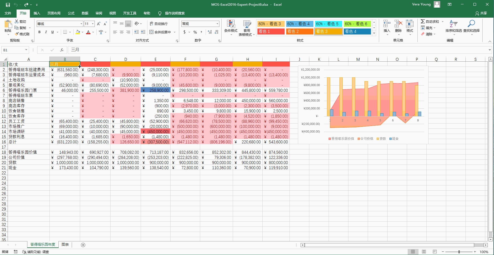
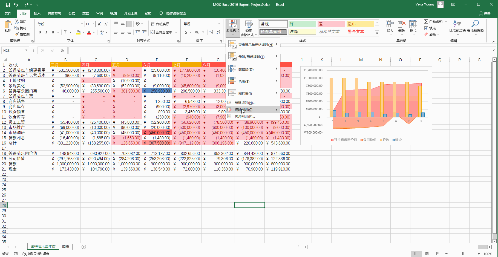
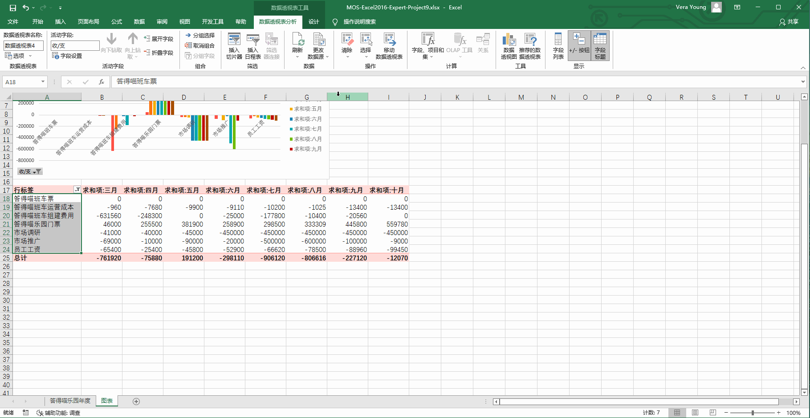
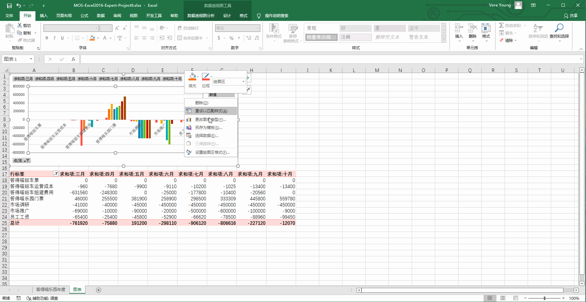
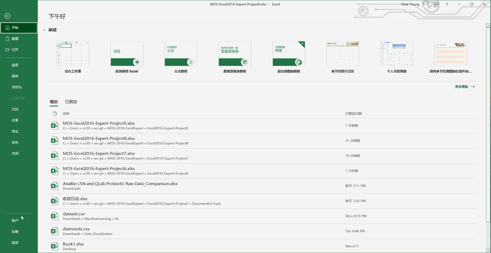

# Back to Main File
[Back](../README.md)

# Exercise File
[Expert-Project9](MOS-Excel2016-Expert-Project9.xlsx)

# Description
去年你开办了答得喵游乐园。你决定为你的利益相关者制作一份年末财务汇报。

# Task 1
使用Excel填充功能，在C1:I1单元格填充月份四月到十月。不要改变单元格格式。
# Task 1 Answer

  
Click to see answer

# Task 2
移除“答得喵乐园年度”工作表中的所有的条件格式。

# Task 2 Answer

  
Click to see answer

# Task 3
在“图表”工作表，为收/支列增加切片器。

# Task 3 Answer

  
Click to see answer

# Task 4
在“图表”工作表，将数据透视图作为模板保存在指定输出位置，文件名为“答得喵图表”。（指定输出位置点击【查询文件夹】查看）

# Task 4 Answer

  
Click to see answer

# Task 5
在功能区显示开发工具选项卡。

# Task 5 Answer

  
Click to see answer

